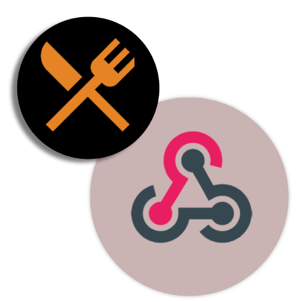

mealie-webhook-handler
===
[](https://github.com/timo-reymann/mealie-webhook-handler/blob/main/LICENSE)
[](https://app.circleci.com/pipelines/github/timo-reymann/mealie-webhook-handler)
[](https://github.com/timo-reymann/mealie-webhook-handler/releases)
[![Renovate](https://img.shields.io/badge/renovate-enabled-green?logo=data:image/svg+xml;base64,PHN2ZyB4bWxucz0iaHR0cDovL3d3dy53My5vcmcvMjAwMC9zdmciIHZpZXdCb3g9IjAgMCAzNjkgMzY5Ij48Y2lyY2xlIGN4PSIxODkuOSIgY3k9IjE5MC4yIiByPSIxODQuNSIgZmlsbD0iI2ZmZTQyZSIgdHJhbnNmb3JtPSJ0cmFuc2xhdGUoLTUgLTYpIi8+PHBhdGggZmlsbD0iIzhiYjViNSIgZD0iTTI1MSAyNTZsLTM4LTM4YTE3IDE3IDAgMDEwLTI0bDU2LTU2YzItMiAyLTYgMC03bC0yMC0yMWE1IDUgMCAwMC03IDBsLTEzIDEyLTktOCAxMy0xM2ExNyAxNyAwIDAxMjQgMGwyMSAyMWM3IDcgNyAxNyAwIDI0bC01NiA1N2E1IDUgMCAwMDAgN2wzOCAzOHoiLz48cGF0aCBmaWxsPSIjZDk1NjEyIiBkPSJNMzAwIDI4OGwtOCA4Yy00IDQtMTEgNC0xNiAwbC00Ni00NmMtNS01LTUtMTIgMC0xNmw4LThjNC00IDExLTQgMTUgMGw0NyA0N2M0IDQgNCAxMSAwIDE1eiIvPjxwYXRoIGZpbGw9IiMyNGJmYmUiIGQ9Ik04MSAxODVsMTgtMTggMTggMTgtMTggMTh6Ii8+PHBhdGggZmlsbD0iIzI1YzRjMyIgZD0iTTIyMCAxMDBsMjMgMjNjNCA0IDQgMTEgMCAxNkwxNDIgMjQwYy00IDQtMTEgNC0xNSAwbC0yNC0yNGMtNC00LTQtMTEgMC0xNWwxMDEtMTAxYzUtNSAxMi01IDE2IDB6Ii8+PHBhdGggZmlsbD0iIzFkZGVkZCIgZD0iTTk5IDE2N2wxOC0xOCAxOCAxOC0xOCAxOHoiLz48cGF0aCBmaWxsPSIjMDBhZmIzIiBkPSJNMjMwIDExMGwxMyAxM2M0IDQgNCAxMSAwIDE2TDE0MiAyNDBjLTQgNC0xMSA0LTE1IDBsLTEzLTEzYzQgNCAxMSA0IDE1IDBsMTAxLTEwMWM1LTUgNS0xMSAwLTE2eiIvPjxwYXRoIGZpbGw9IiMyNGJmYmUiIGQ9Ik0xMTYgMTQ5bDE4LTE4IDE4IDE4LTE4IDE4eiIvPjxwYXRoIGZpbGw9IiMxZGRlZGQiIGQ9Ik0xMzQgMTMxbDE4LTE4IDE4IDE4LTE4IDE4eiIvPjxwYXRoIGZpbGw9IiMxYmNmY2UiIGQ9Ik0xNTIgMTEzbDE4LTE4IDE4IDE4LTE4IDE4eiIvPjxwYXRoIGZpbGw9IiMyNGJmYmUiIGQ9Ik0xNzAgOTVsMTgtMTggMTggMTgtMTggMTh6Ii8+PHBhdGggZmlsbD0iIzFiY2ZjZSIgZD0iTTYzIDE2N2wxOC0xOCAxOCAxOC0xOCAxOHpNOTggMTMxbDE4LTE4IDE4IDE4LTE4IDE4eiIvPjxwYXRoIGZpbGw9IiMzNGVkZWIiIGQ9Ik0xMzQgOTVsMTgtMTggMTggMTgtMTggMTh6Ii8+PHBhdGggZmlsbD0iIzFiY2ZjZSIgZD0iTTE1MyA3OGwxOC0xOCAxOCAxOC0xOCAxOHoiLz48cGF0aCBmaWxsPSIjMzRlZGViIiBkPSJNODAgMTEzbDE4LTE3IDE4IDE3LTE4IDE4ek0xMzUgNjBsMTgtMTggMTggMTgtMTggMTh6Ii8+PHBhdGggZmlsbD0iIzk4ZWRlYiIgZD0iTTI3IDEzMWwxOC0xOCAxOCAxOC0xOCAxOHoiLz48cGF0aCBmaWxsPSIjYjUzZTAyIiBkPSJNMjg1IDI1OGw3IDdjNCA0IDQgMTEgMCAxNWwtOCA4Yy00IDQtMTEgNC0xNiAwbC02LTdjNCA1IDExIDUgMTUgMGw4LTdjNC01IDQtMTIgMC0xNnoiLz48cGF0aCBmaWxsPSIjOThlZGViIiBkPSJNODEgNzhsMTgtMTggMTggMTgtMTggMTh6Ii8+PHBhdGggZmlsbD0iIzAwYTNhMiIgZD0iTTIzNSAxMTVsOCA4YzQgNCA0IDExIDAgMTZMMTQyIDI0MGMtNCA0LTExIDQtMTUgMGwtOS05YzUgNSAxMiA1IDE2IDBsMTAxLTEwMWM0LTQgNC0xMSAwLTE1eiIvPjxwYXRoIGZpbGw9IiMzOWQ5ZDgiIGQ9Ik0yMjggMTA4bC04LThjLTQtNS0xMS01LTE2IDBMMTAzIDIwMWMtNCA0LTQgMTEgMCAxNWw4IDhjLTQtNC00LTExIDAtMTVsMTAxLTEwMWM1LTQgMTItNCAxNiAweiIvPjxwYXRoIGZpbGw9IiNhMzM5MDQiIGQ9Ik0yOTEgMjY0bDggOGM0IDQgNCAxMSAwIDE2bC04IDdjLTQgNS0xMSA1LTE1IDBsLTktOGM1IDUgMTIgNSAxNiAwbDgtOGM0LTQgNC0xMSAwLTE1eiIvPjxwYXRoIGZpbGw9IiNlYjZlMmQiIGQ9Ik0yNjAgMjMzbC00LTRjLTYtNi0xNy02LTIzIDAtNyA3LTcgMTcgMCAyNGw0IDRjLTQtNS00LTExIDAtMTZsOC04YzQtNCAxMS00IDE1IDB6Ii8+PHBhdGggZmlsbD0iIzEzYWNiZCIgZD0iTTEzNCAyNDhjLTQgMC04LTItMTEtNWwtMjMtMjNhMTYgMTYgMCAwMTAtMjNMMjAxIDk2YTE2IDE2IDAgMDEyMiAwbDI0IDI0YzYgNiA2IDE2IDAgMjJMMTQ2IDI0M2MtMyAzLTcgNS0xMiA1em03OC0xNDdsLTQgMi0xMDEgMTAxYTYgNiAwIDAwMCA5bDIzIDIzYTYgNiAwIDAwOSAwbDEwMS0xMDFhNiA2IDAgMDAwLTlsLTI0LTIzLTQtMnoiLz48cGF0aCBmaWxsPSIjYmY0NDA0IiBkPSJNMjg0IDMwNGMtNCAwLTgtMS0xMS00bC00Ny00N2MtNi02LTYtMTYgMC0yMmw4LThjNi02IDE2LTYgMjIgMGw0NyA0NmM2IDcgNiAxNyAwIDIzbC04IDhjLTMgMy03IDQtMTEgNHptLTM5LTc2Yy0xIDAtMyAwLTQgMmwtOCA3Yy0yIDMtMiA3IDAgOWw0NyA0N2E2IDYgMCAwMDkgMGw3LThjMy0yIDMtNiAwLTlsLTQ2LTQ2Yy0yLTItMy0yLTUtMnoiLz48L3N2Zz4=)](https://renovatebot.com)

<p align="center">
	
    <br />
    Webhook handler for recipes hosted on a mealie.io instance
</p>

## Features

<!-- List features as bullet points -->

- Customizable templates
- Generic output support

## Want to contribute a new output?

1. Fork this repository
2. Add a new output in `outputs/<your name>/main.go` (see `github_pr` for reference)
3. Create a PR

## Installation

It's recommended to install it next to your mealie instance using docker-compose.

1. Create `webhook-templates/chowdown-template.gotpl`
   ```gotemplate
   ---
   layout: recipe
   title: {{ .Recipe.Name }}
   {{- if .HasImage }}
   image: {{ .Recipe.Slug }}.webp
   {{- end }}
   tags: {{- range $index, $tag := .Recipe.Tags }} {{- if $index }},{{ end }} {{ $tag.Name }} {{- end }}
   
   ingredients:
   {{- range $val := .Recipe.RecipeIngredient }}
     - {{ if $val.Quantity }} {{ $val.Quantity }}{{- end -}}{{- if $val.Unit }} {{ or $val.Unit.Abbreviation $val.Unit.Name }}{{- end }} {{ if or $val.Quantity $val.Unit }} {{- end }}{{ $val.Food.Name }}{{- if $val.Note }} {{ $val.Note }}{{- end }}
   {{- end }}

   directions:
   {{- range $val := .Recipe.RecipeInstructions }}
     - {{ $val.Text }}
   {{- end }}
   ---
   
   {{ .Recipe.Description }}
   ```
2. Create a `webhook-config.toml`
   ```toml
   # chowdown is a sample GitHub webhook to sync recipes to chowdown github repos
   [webhook.chowdown_github_sync]
   template_path = "/etc/mealie-webhook-handler/templates/chowdown-template.gotpl"
   output = "github_pr"
    
   [webhook.chowdown_github_sync.output_options]
   title = "chore: Sync recipe {{ .Recipe.Name }} from mealie"
   body = """
   Update recipe {{ .Recipe.Name }}
   """
   slug = "your-user/recipes"
   source_branch = "sync/recipe/{{ .Recipe.Slug }}"
   target_branch = "gh-pages"
   recipe_path = "_recipes/{{ .Recipe.Slug }}.md"
   image_path = "images/{{ .Recipe.Slug }}.webp"
   commit_message = "chore: Sync {{ .Recipe.Name }} from mealie"
    
   [mealie]
   api_url = "http://mealie:9000/api"
   ```
3. Configure the webhook handler next to mealie
   ```yaml
   services:
     mealie:
     # mealie configuration
     mealie-webhook-handler:
       image: timoreymann/mealie-webhook-handler
       restart: always
       environment:
         GITHUB_TOKEN: <personal access token>
       command:
         - mealie-webhook-handler
         - --config-file
         - /etc/mealie-webhook-handler/config.toml
       volumes:
         - ./webhook-config.toml:/etc/mealie-webhook-handler/config.toml
         - ./webhook-templates:/etc/mealie-webhook-handler/templates
    ```

## Usage

1. Navigate to your Mealie instance
2. Go to `Settings > Data Management`
3. Select `Recipe Actions`
4. Click `Create`
5. Fill out the form
    - `Title`: *Sync to Chowdown*
    - `URL`: *http://mealie-webhook-handler:2025/webhook/chowdown_github_sync*
    - `Action Type`: *post*
6. On your recipe page open the actions and click on `Sync to Chowdown`
7. A PR will be created in your chowdown repo

## Motivation

<!-- Add bit of context why the project has been created -->

## Contributing

I love your input! I want to make contributing to this project as easy and transparent as possible, whether it's:

- Reporting a bug
- Discussing the current state of the configuration
- Submitting a fix
- Proposing new features
- Becoming a maintainer

To get started please read the [Contribution Guidelines](./CONTRIBUTING.md).

## Development

### Requirements

<!-- Delete the ones not required -->

- [GNU make](https://www.gnu.org/software/make/)
- [Docker](https://docs.docker.com/get-docker/)
- [Go](https://go.dev/doc/install)

### Test

<!-- Add testing instructions -->

```sh
make test-coverage-report
```

### Build

<!-- Add building instructions -->

```sh
make build
```
